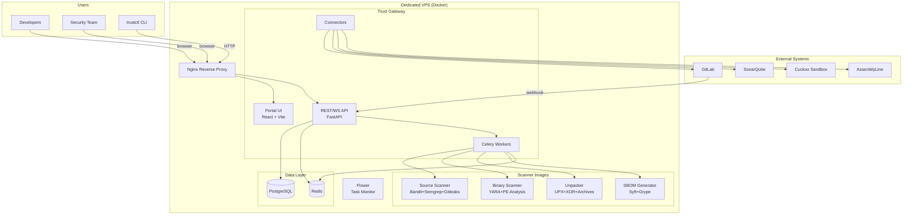
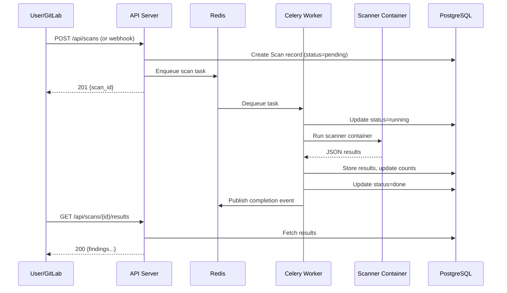
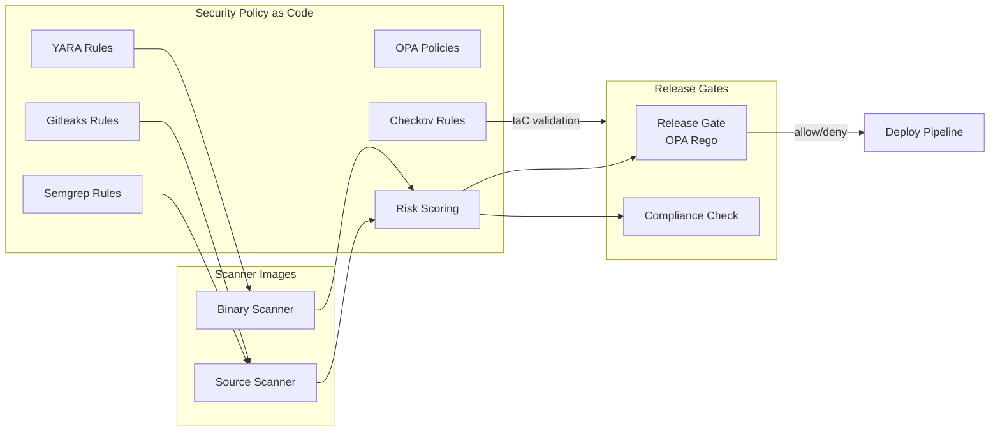
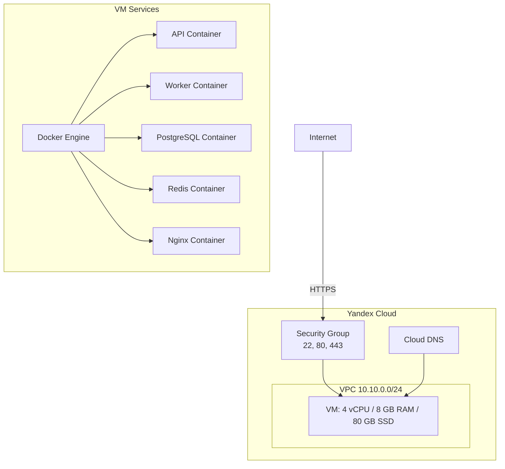

# Security Platform — Architecture

## High-Level Overview

## Data Flow — Scan Pipeline

## Security Policy Flow

## Infrastructure

## Port Mapping

| Service | Internal Port | External Port | Access |
|---------|--------------|---------------|--------|
| Nginx | 80/443 | 80/443 | Public |
| API | 8000 | - | Via Nginx |
| PostgreSQL | 5432 | 127.0.0.1:5432 | Local only |
| Redis | 6379 | 127.0.0.1:6379 | Local only |
| Flower | 5555 | 127.0.0.1:5555 | Local only |
