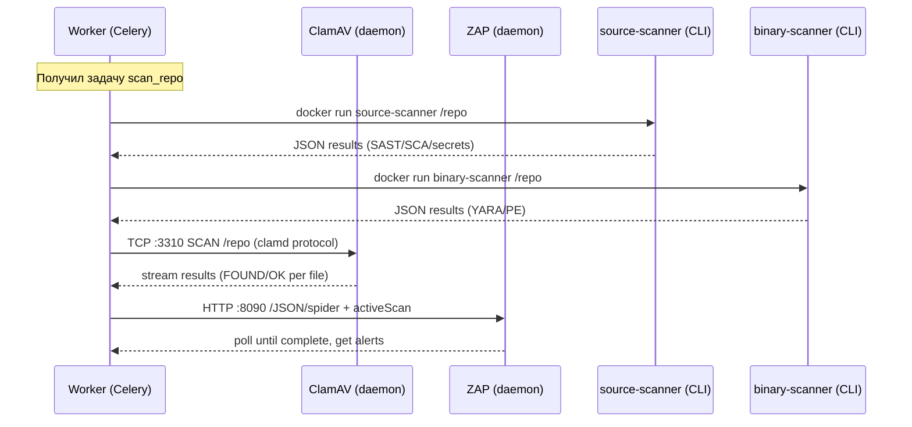

# Container Architecture — Security Platform

## Принцип разделения

Сервисы разделены на **три типа** по модели жизненного цикла:

| Тип | Поведение | Примеры |
|-----|-----------|---------|
| **Core Services** | Работают постоянно, обрабатывают запросы | API, Worker, Beat, Nginx |
| **Daemon Scanners** | Работают постоянно, ожидают запросов от воркера | ClamAV, OWASP ZAP |
| **CLI Scanners** | Запускаются on-demand, завершаются после скана | source-scanner, binary-scanner, sbom-generator, unpacker |

## Полная карта контейнеров

```
┌─────────────────────────────────────────────────────────────────────────┐
│                         VPS (Docker Host)                                │
├─────────────────────────────────────────────────────────────────────────┤
│                                                                         │
│  ┌─── Core Services ──────────────────────────────────────────────┐    │
│  │                                                                 │    │
│  │  ┌──────────┐  ┌──────────┐  ┌──────────┐  ┌──────────┐      │    │
│  │  │  nginx   │  │   api    │  │  worker  │  │   beat   │      │    │
│  │  │ :80/:443 │→ │  :8000   │  │ (celery) │  │(schedule)│      │    │
│  │  └──────────┘  └──────────┘  └──────────┘  └──────────┘      │    │
│  │                                    │                            │    │
│  └────────────────────────────────────┼────────────────────────────┘    │
│                                       │                                 │
│  ┌─── Data Layer ─────────────────────┼───────────────────────────┐    │
│  │                                    │                            │    │
│  │  ┌──────────┐  ┌──────────┐  ┌──────────┐                     │    │
│  │  │ postgres │  │  redis   │  │  flower  │                     │    │
│  │  │  :5432   │  │  :6379   │  │  :5555   │                     │    │
│  │  └──────────┘  └──────────┘  └──────────┘                     │    │
│  │                                                                 │    │
│  └─────────────────────────────────────────────────────────────────┘    │
│                                       │                                 │
│  ┌─── Daemon Scanners ────────────────┼───────────────────────────┐    │
│  │                                    │                            │    │
│  │  ┌──────────────┐  ┌──────────────────┐                       │    │
│  │  │   clamav     │  │    owasp-zap     │                       │    │
│  │  │ clamd :3310  │  │   ZAP API :8090  │                       │    │
│  │  │ ~1GB RAM     │  │   ~2GB RAM       │                       │    │
│  │  │ (sig DB)     │  │   (scan engine)  │                       │    │
│  │  └──────────────┘  └──────────────────┘                       │    │
│  │                                                                 │    │
│  └─────────────────────────────────────────────────────────────────┘    │
│                                       │                                 │
│  ┌─── CLI Scanners (on-demand) ───────┼───────────────────────────┐    │
│  │    Запускаются воркером через Docker API                        │    │
│  │                                                                 │    │
│  │  ┌───────────────┐  ┌─────────────────┐  ┌──────────────┐     │    │
│  │  │source-scanner │  │binary-scanner   │  │sbom-generator│     │    │
│  │  │Bandit+Semgrep │  │YARA+PE+entropy  │  │Syft+Grype    │     │    │
│  │  │+Gitleaks+pip  │  │                 │  │+CycloneDX    │     │    │
│  │  └───────────────┘  └─────────────────┘  └──────────────┘     │    │
│  │                                                                 │    │
│  │  ┌───────────────┐                                             │    │
│  │  │   unpacker    │                                             │    │
│  │  │UPX+XOR+arch  │                                             │    │
│  │  └───────────────┘                                             │    │
│  │                                                                 │    │
│  └─────────────────────────────────────────────────────────────────┘    │
│                                                                         │
└─────────────────────────────────────────────────────────────────────────┘
```

## Детализация контейнеров

### Core Services (always running)

| Контейнер | Образ | Порт | RAM | CPU | Роль |
|-----------|-------|------|-----|-----|------|
| **nginx** | nginx:alpine | 80, 443 | 128M | 0.25 | Reverse proxy, TLS, rate limit |
| **api** | custom (Dockerfile.full) | 8000 | 1G | 1.0 | REST/WS API, UI serving |
| **worker** | custom (Dockerfile.full) | — | 2G | 2.0 | Celery worker, оркестрация сканов |
| **beat** | custom (Dockerfile.full) | — | 256M | 0.25 | Celery beat scheduler |

### Data Layer (always running)

| Контейнер | Образ | Порт | RAM | CPU | Роль |
|-----------|-------|------|-----|-----|------|
| **postgres** | postgres:16-alpine | 5432 (local) | 512M | 0.5 | Основная БД (скны, проекты, коннекторы) |
| **redis** | redis:7-alpine | 6379 (local) | 300M | 0.25 | Брокер задач + кэш + pub/sub |
| **flower** | mher/flower:2.0 | 5555 (local) | 256M | 0.25 | Мониторинг Celery tasks |

### Daemon Scanners (always running, ожидают запросов)

| Контейнер | Образ | Порт | RAM | CPU | Почему отдельно |
|-----------|-------|------|-----|-----|-----------------|
| **clamav** | clamav/clamav:1.3 | 3310 (local) | 1G | 0.5 | Базы сигнатур ~400MB в RAM, долгий запуск (~30s), не привязан к конкретному скану |
| **owasp-zap** | ghcr.io/zaproxy/zaproxy:stable | 8090 (local) | 2G | 1.0 | Генерирует HTTP трафик, нужна сетевая изоляция, тяжёлый JVM процесс |

#### Почему daemon, а не CLI:
- **ClamAV**: загрузка баз сигнатур занимает 20-30 секунд. Если запускать каждый раз — скан будет на 30с дольше. Daemon держит базы в RAM.
- **ZAP**: JVM cold start ~15с + нужен постоянный proxy для перехвата трафика.

### CLI Scanners (on-demand, запускаются воркером)

| Контейнер | Образ | RAM | CPU | Время жизни |
|-----------|-------|-----|-----|-------------|
| **source-scanner** | custom | 512M | 1.0 | 1-5 мин |
| **binary-scanner** | custom | 512M | 0.5 | 30с-2 мин |
| **sbom-generator** | custom | 512M | 0.5 | 30с-1 мин |
| **unpacker** | custom | 256M | 0.5 | 10с-1 мин |

#### Почему CLI, а не daemon:
- Stateless, нет предзагрузки
- Изоляция между сканами (один контейнер на один скан)
- Легко масштабируются параллельно
- Нет утечки ресурсов между запусками

## Сетевая изоляция

```
┌─── network: security-platform (default) ───────────────────┐
│  api ↔ postgres ↔ redis ↔ worker ↔ clamav ↔ flower        │
└────────────────────────────────────────────────────────────┘

┌─── network: zap-isolated ──────────────────────────────────┐
│  worker ↔ owasp-zap ↔ (target app under test)             │
│  НЕТ доступа к postgres/redis/api напрямую                 │
└────────────────────────────────────────────────────────────┘

┌─── network: scanner-runtime ───────────────────────────────┐
│  worker ↔ source-scanner ↔ binary-scanner (эфемерные)      │
│  Только доступ к /tmp/repos (volume mount)                 │
└────────────────────────────────────────────────────────────┘
```

## Взаимодействие Worker → Scanners



## Resource Budget (минимальный сервер)

| Группа | RAM | CPU |
|--------|-----|-----|
| Core (api+worker+beat+nginx) | 3.5G | 3.5 |
| Data (postgres+redis+flower) | 1.1G | 1.0 |
| Daemon Scanners (clamav+zap) | 3.0G | 1.5 |
| CLI Scanners (peak, 2 parallel) | 1.0G | 2.0 |
| OS + overhead | 0.5G | — |
| **Итого** | **~9G** | **8 vCPU** |

**Рекомендация**: VPS с 8-16 GB RAM и 4-8 vCPU. При 8GB — ZAP можно запускать on-demand (не как daemon).

## Оптимизация для меньших серверов (4-8 GB RAM)

1. ZAP → CLI mode (запуск по требованию, не daemon)
2. ClamAV → daemon (обязательно, экономит 30с на каждый скан)
3. Flower → отключить в production
4. Worker concurrency = 1-2
